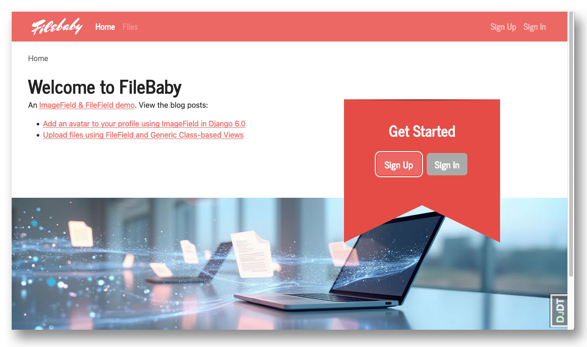
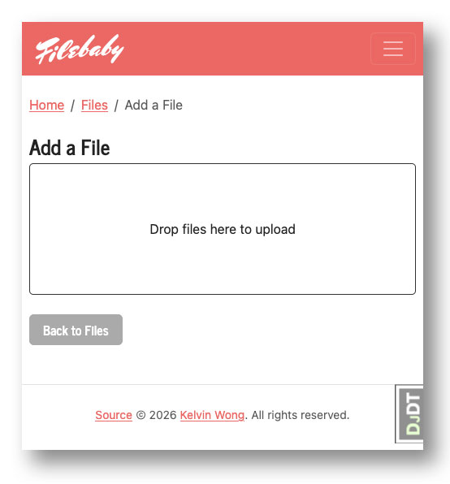
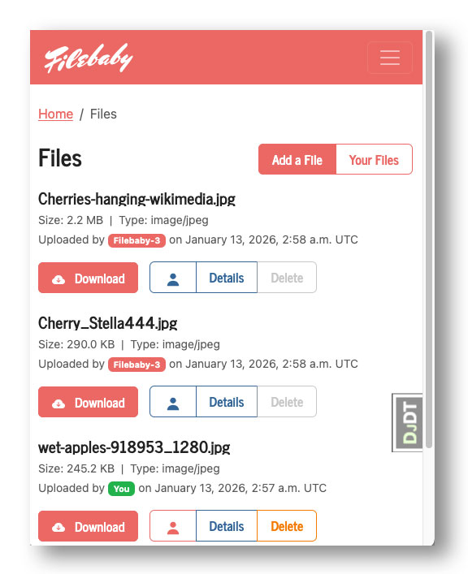

# Filebaby - A File Sharing Demo



This app demonstrates working examples of `FileField` and `ImageField` in **Django**. Download it, run it locally, and explore the code to learn how file uploads work in practice.

**Related blog posts:**
* [Django User Avatar Upload Tutorial: Complete ImageField Guide For Django 6.0](https://kelvinwong.ca/blog/2026/add-an-avatar-to-your-profile-using-imagefield-in-django-6-0/?utm_source=github)
* [Keep User Files Private in Django 6.0](https://kelvinwong.ca/blog/2026/keep-user-files-private-in-django-6-0/?utm_source=github)


## Quickstart

### Prerequisites

- Python 3.12 or higher (required for Django 6.0)
- macOS or Linux
- Git

### Get the Source Code

Get the source code from GitHub:

```bash
git clone git@github.com:kelvinwong-ca/filebaby.git
cd filebaby
```

### Create a Virtual Environment

Isolate this project from your system Python:

```bash
python -m venv .venv
source .venv/bin/activate
```

### Install Dependencies

Then install the application's required packages:

```bash
pip install -r requirements.txt
```

> The `python-magic` package requires the C-library `libmagic` to be available. Read the [installation](https://pypi.org/project/python-magic/) for more information.

**Optional:** For development tools like [Django Debug Toolbar](https://django-debug-toolbar.readthedocs.io/en/latest/), install the dev requirements instead:

```bash
pip install -r requirements_dev.txt
```

> Note: `requirements_dev.txt` includes everything from `requirements.txt`, so you only need to install one.

### Configure Environment Variables

> Set a unique `SECRET_KEY`

Copy the sample environment file and review it:

```bash
cp env-sample .env
```

The default configuration sets `DEBUG=True`, which is appropriate for local development.

### Initialize the Database

Run migrations to set up your database:

```bash
python manage.py migrate
```

### Start the Server

Launch the development server:

```bash
python manage.py runserver
```

You can view the app: [http://127.0.0.1:8000/](http://127.0.0.1:8000/)

## Verify Your Setup

> You need to install the dev requirements to run the tests! `pip install -r requirements_dev.txt`

Run the test suite to confirm everything is working:

```bash
python manage.py test
```

You should see a few dozen tests pass. If any tests fail, review the previous steps before continuing.

## Using the App

Now that the application is running, try it out by creating a user and uploading files.

### Create a User

You need a user account to upload files. You can either:

1. Click the **"Sign Up"** button and fill in the registration form, or
2. Create a superuser from the command line:

```bash
python manage.py createsuperuser
```

### Add a file



Click the **"Add a File"** button to navigate to `/files/create/`. You'll see a dropzone where you can:
- Click to open the file picker, or
- Drag and drop files directly onto the area

Files upload immediately when dropped. With JavaScript enabled, you'll see a visual checkmark on successful upload. Without JavaScript, the app falls back to Django's standard file widget.


### List All Files



Click **"All Files"** from the home page to navigate to `/files/`. This page lists all uploaded files.

> **Note:** Files from users who have disabled their "public" profile setting will not be visible to other users.
